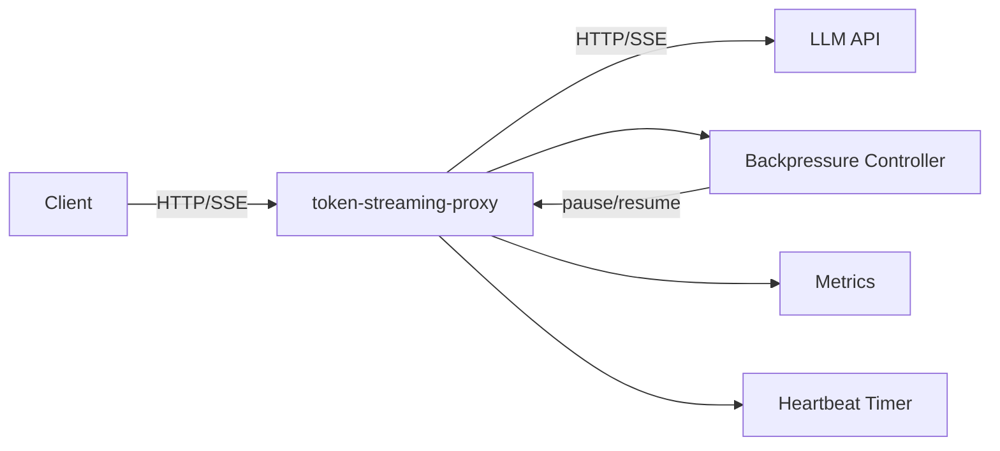

# token-streaming-proxy

> High-performance streaming proxy for LLM APIs with SSE backpressure handling

[](https://github.com/jrajath94/token-streaming-proxy/actions)
[](https://opensource.org/licenses/MIT)
[](https://www.python.org/downloads/)

## Why This Exists

Standard reverse proxies (Nginx, HAProxy, Caddy) buffer responses by default, adding latency to LLM streaming. They don't understand SSE semantics, can't apply backpressure when clients are slow, and don't send keepalives to prevent timeout disconnects. This proxy is purpose-built for LLM APIs: zero buffering, flow-controlled SSE forwarding, and automatic heartbeats.

## Architecture



## Quick Start

```bash
git clone https://github.com/jrajath94/token-streaming-proxy.git
cd token-streaming-proxy
make install && make run
```

```bash
# Run as a proxy to OpenAI
token-proxy --upstream https://api.openai.com --port 8080

# Or any OpenAI-compatible API
token-proxy --upstream http://localhost:11434 --port 8080
```

```python
# Client code -- just change the base URL
import openai
client = openai.OpenAI(base_url="http://localhost:8080/v1")
```

## Key Design Decisions

| Decision                        | Rationale                                       | Alternative Considered                        |
| ------------------------------- | ----------------------------------------------- | --------------------------------------------- |
| Starlette + uvicorn             | Lightweight ASGI, no framework overhead         | FastAPI (heavier), raw asyncio (no routing)   |
| High/low watermark backpressure | Prevents buffer oscillation (hysteresis)        | Simple size check (causes rapid pause/resume) |
| SSE comments for heartbeat      | Clients ignore comments; keeps connection alive | Periodic data events (triggers handlers)      |
| httpx async client              | HTTP/2 support, connection pooling, streaming   | aiohttp (API less clean), requests (sync)     |
| Per-stream metrics              | Observability without external deps             | Prometheus (heavier), no metrics (blind)      |

## Benchmarks

| Metric                 | Value              | Conditions                      |
| ---------------------- | ------------------ | ------------------------------- |
| SSE parsing throughput | 525,086 events/s   | 100 tokens/event, single thread |
| SSE parsing bandwidth  | 91.47 MB/s         | Raw byte throughput             |
| Token extraction       | 317,493 tokens/s   | OpenAI chat format              |
| Backpressure push      | 1,534,272 events/s | No contention                   |
| Backpressure pull      | 1,404,289 events/s | No contention                   |
| Concurrent streams     | 99,040 events/s    | 50 streams, 100 events each     |
| Avg stream latency     | 0.2ms              | In-process, no network          |

## Features

- **Zero-buffering SSE proxy**: Events forwarded as they arrive, never accumulated
- **Backpressure control**: High/low watermark flow control prevents OOM with slow clients
- **Automatic heartbeats**: SSE comments keep connections alive through idle periods
- **Metrics per stream**: TTFB, throughput, backpressure count, event counts
- **Health check**: `/health` endpoint for load balancer integration
- **Metrics endpoint**: `/metrics` for observability
- **OpenAI-compatible**: Works with any API using SSE streaming (OpenAI, Anthropic, Ollama, vLLM)

## Testing

```bash
make test    # 108 tests, 92% coverage
make bench   # Performance benchmarks
make lint    # Ruff + mypy
```

## Project Structure

```
token-streaming-proxy/
├── src/token_streaming_proxy/
│   ├── core.py          # StreamingProxy ASGI application
│   ├── sse.py           # SSE parser and encoder
│   ├── backpressure.py  # Flow control with watermarks
│   ├── models.py        # Config, metrics, event dataclasses
│   ├── utils.py         # Mock streams, token extraction
│   ├── cli.py           # CLI entry point
│   └── exceptions.py    # Custom error types
├── tests/               # 108 tests
├── benchmarks/           # Throughput benchmarks
├── examples/             # Quickstart demo
└── docs/                 # Architecture + interview prep
```

## License

MIT
