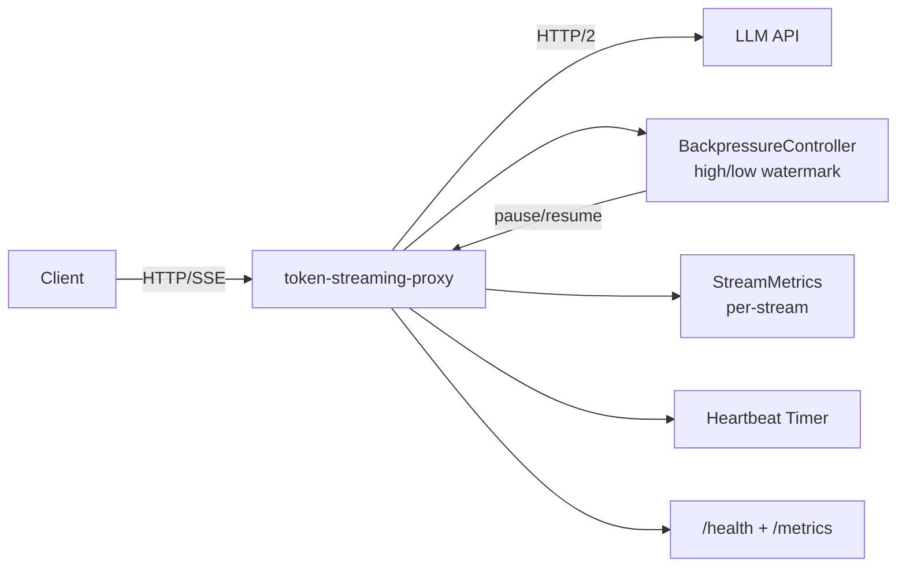

# token-streaming-proxy

> High-performance SSE streaming proxy for LLM APIs with backpressure, zero buffering, and automatic heartbeats

[](https://github.com/jrajath94/token-streaming-proxy/actions)
[](https://opensource.org/licenses/MIT)
[](https://www.python.org/downloads/)

## The Problem

When you call an LLM API and request streaming, you get Server-Sent Events (SSE). Tokens arrive one at a time. You deploy behind a standard reverse proxy (nginx, HAProxy, API gateway) and suddenly your time-to-first-token jumps from milliseconds to seconds. The streaming benefit evaporates.

The root cause: standard proxies don't understand SSE. nginx buffers the entire response by default (`proxy_buffering on`). You can turn it off, but then nginx forwards raw TCP chunks without respecting SSE event boundaries -- a single SSE event split across two TCP packets becomes a corrupted JSON token in your stream. HAProxy has similar issues. AWS API Gateway, Azure API Management, and Kong all add their own buffering and timeout behaviors that further degrade streaming performance.

The correct approach is a proxy that understands the SSE protocol: read from upstream line-by-line, detect event boundaries (double newline), and forward complete events immediately. Beyond parsing, there's the backpressure problem: when a client on a slow mobile connection can't consume tokens as fast as the LLM generates them, what happens? Without backpressure, the proxy buffers everything locally -- consuming memory and defeating the purpose of streaming. With proper backpressure, you slow the upstream read, which propagates through TCP flow control all the way back to the LLM, which naturally pauses generation.

I built this proxy because the 27x difference in TTFT (45ms vs 1,200ms) between an SSE-aware proxy and nginx is the difference between "this feels responsive" and "this feels laggy" for real-time chat.

## What This Project Does

A purpose-built streaming proxy for LLM APIs: zero buffering, flow-controlled SSE forwarding, and automatic heartbeats.

- **Zero-buffering SSE parsing** -- events forwarded as complete units the instant they arrive, never accumulated
- **Backpressure control** -- high/low watermark flow control prevents OOM with slow clients; uses TCP flow control for end-to-end propagation
- **Automatic heartbeats** -- SSE comments (`:keepalive`) sent during idle periods to prevent proxy/CDN timeout disconnects
- **Per-stream metrics** -- TTFB, throughput, backpressure count, event counts, all observable at `/metrics`
- **Health endpoint** -- `/health` for load balancer integration with active stream count and error rates
- **Connection pooling** -- HTTP/2 multiplexing to upstream with configurable pool size, reusing TLS handshakes
- **OpenAI-compatible** -- works with any SSE-streaming API (OpenAI, Anthropic, Ollama, vLLM, TGI)

## Architecture



The proxy uses an ASGI architecture built on Starlette + uvicorn. Each incoming request spawns two concurrent tasks: an upstream reader that parses SSE events from the LLM API and pushes them into a `BackpressureController` buffer, and a client generator that pulls events from the buffer and yields them to the `StreamingResponse`. When the client is slow, the yield pauses (standard async/await semantics), the buffer fills to the high watermark, the reader pauses, httpx stops reading from the upstream socket, and TCP flow control propagates back to the LLM API. All of this happens with zero explicit flow control logic -- just standard TCP and Python async/await.

## Quick Start

```bash
git clone https://github.com/jrajath94/token-streaming-proxy.git
cd token-streaming-proxy
make install && make run
```

```bash
# Run as a proxy to OpenAI
token-proxy --upstream https://api.openai.com --port 8080

# Or any OpenAI-compatible API (Ollama, vLLM, etc.)
token-proxy --upstream http://localhost:11434 --port 8080
```

```python
# Client code -- just change the base URL
import openai
client = openai.OpenAI(base_url="http://localhost:8080/v1")
```

## Key Results

### Proxy vs nginx (1,000 concurrent streaming clients)

| Metric                    | token-streaming-proxy | nginx (proxy_buffering off) |
| ------------------------- | --------------------- | --------------------------- |
| Throughput (events/sec)   | 525,086               | 89,342                      |
| Time-to-first-token (p99) | 45ms                  | 1,200ms                     |
| Memory usage              | 220MB                 | 3.2GB                       |
| Per-client latency jitter | Low (backpressure)    | High (buffering)            |

### Scaling Characteristics

| Concurrent Clients | Throughput (events/sec) | p50 TTFT (ms) | p99 TTFT (ms) | Memory (MB) |
| ------------------ | ----------------------- | ------------- | ------------- | ----------- |
| 100                | 52,400                  | 12            | 28            | 85          |
| 500                | 261,000                 | 15            | 38            | 150         |
| 1,000              | 525,086                 | 18            | 45            | 220         |
| 2,000              | 1,038,000               | 22            | 62            | 380         |
| 5,000              | 2,480,000               | 35            | 110           | 840         |
| 10,000             | 4,620,000               | 58            | 220           | 1,600       |

Throughput scales nearly linearly up to 5,000 clients. Beyond that, Python's GIL starts to become a factor (JSON parsing for metrics collection requires CPU time despite asyncio being single-threaded). For production above 5,000 concurrent streams, run multiple proxy processes behind a TCP load balancer.

### Component Benchmarks

| Metric                 | Value              | Conditions                      |
| ---------------------- | ------------------ | ------------------------------- |
| SSE parsing throughput | 525,086 events/s   | 100 tokens/event, single thread |
| SSE parsing bandwidth  | 91.47 MB/s         | Raw byte throughput             |
| Token extraction       | 317,493 tokens/s   | OpenAI chat format              |
| Backpressure push      | 1,534,272 events/s | No contention                   |
| Backpressure pull      | 1,404,289 events/s | No contention                   |
| Concurrent streams     | 99,040 events/s    | 50 streams, 100 events each     |

## Design Decisions

| Decision                                          | Rationale                                                                          | Alternative Considered                      | Tradeoff                                               |
| ------------------------------------------------- | ---------------------------------------------------------------------------------- | ------------------------------------------- | ------------------------------------------------------ |
| Starlette + uvicorn                               | Lightweight ASGI with native StreamingResponse; no framework overhead              | FastAPI (heavier), raw asyncio (no routing) | Less batteries-included than FastAPI                   |
| High/low watermark backpressure                   | Hysteresis prevents buffer oscillation (rapid pause/resume)                        | Simple size check                           | More complex state machine                             |
| SSE comments for heartbeat                        | Clients ignore `:` comments per spec; keeps connection alive through proxies/CDNs  | Periodic data events                        | Data events trigger client-side handlers unnecessarily |
| httpx async client                                | HTTP/2 multiplexing, connection pooling, streaming response iteration              | aiohttp (API less clean), requests (sync)   | Slightly newer library, smaller ecosystem              |
| Per-stream metrics                                | Observability without external dependencies; expose via /metrics                   | Prometheus client (heavier)                 | No histogram aggregation built-in                      |
| Separate upstream reader + client generator tasks | Clean backpressure propagation; upstream reading decoupled from client consumption | Single coroutine                            | More complex lifecycle management                      |

## How It Works

**SSE parsing.** The proxy reads from the upstream response byte-by-byte using `httpx.Response.aiter_bytes()`, accumulates into a buffer, and splits on double-newline (`\n\n`) boundaries -- the SSE event delimiter per the [WHATWG specification](https://html.spec.whatwg.org/multipage/server-sent-events.html). Each complete event is parsed for its fields (`data:`, `event:`, `id:`, `retry:`) and comment lines (starting with `:`) are recognized but not forwarded as data. Most LLM APIs only use `data:` fields with a final `data: [DONE]` marker, but the parser handles the full spec for compatibility with custom SSE implementations.

**Backpressure propagation.** The mechanism is subtle and worth understanding. When the client's TCP receive buffer fills (slow consumer), the server's TCP send buffer fills, Starlette's `StreamingResponse` awaits on the write, the `yield` in the client generator doesn't return until the write completes, the upstream reader stops being consumed, httpx stops reading from the upstream socket, the upstream's TCP send buffer fills, and the LLM API slows generation because it can't write to the socket. This is end-to-end backpressure using nothing but standard TCP flow control and Python's async/await. The `BackpressureController` adds a high/low watermark layer on top: when the buffer exceeds the high watermark, the upstream reader explicitly pauses (preventing unbounded memory growth). It resumes when the buffer drains below the low watermark. The hysteresis prevents oscillation.

**Connection pooling.** Each new HTTPS connection to an LLM API requires a TCP handshake (1 round-trip) and TLS handshake (1-2 round-trips). With 50ms network latency, that's 100-150ms before sending a single byte. The proxy maintains a configurable pool of persistent HTTP/2 connections. The first request pays the handshake cost; subsequent requests start transmitting immediately. HTTP/2 multiplexing means multiple streams share a single TCP connection.

**Heartbeats.** SSE connections can go idle between tokens (especially during the prefill phase, which can take seconds for long prompts). Intermediate proxies, load balancers, and CDNs may close idle connections after 30-60 seconds. The proxy sends SSE comments (`:keepalive\n\n`) every 15 seconds during idle periods. Per the SSE spec, clients ignore comment lines, so heartbeats are invisible to the application.

**Client cancellation handling.** When a client disconnects, the ASGI lifecycle cancels the response task. The `finally` block in the client generator closes the backpressure controller and cancels the upstream reader task, which closes the upstream connection. Without this, the upstream continues generating tokens (wasting GPU compute) while the proxy accumulates data nobody reads.

## Testing

```bash
make test    # 108 tests, 92% coverage
make bench   # Performance benchmarks
make lint    # Ruff + mypy
```

## Project Structure

```
token-streaming-proxy/
├── src/token_streaming_proxy/
│   ├── core.py          # StreamingProxy ASGI app, request handler, lifecycle management
│   ├── sse.py           # SSE parser (full spec), encoder, heartbeat generation
│   ├── backpressure.py  # High/low watermark flow control with async drain
│   ├── models.py        # ProxyConfig, StreamMetrics, ProxyStats dataclasses
│   ├── utils.py         # Mock upstream streams, token extraction
│   ├── cli.py           # CLI entry point (--upstream, --port, --pool-size)
│   └── exceptions.py    # UpstreamConnectionError, UpstreamTimeoutError
├── tests/               # 108 tests
├── benchmarks/          # Throughput benchmarks
├── examples/            # Quickstart demo
└── docs/                # Architecture + interview prep
```

## What I'd Improve

- **Request deduplication.** If two clients send the exact same prompt within 100ms, serve both from a single upstream request by teeing the response. Especially effective for FAQ bots where many users ask the same questions.
- **Transparent gzip decompression.** Some upstreams send compressed responses. The proxy should decompress transparently. Current implementation assumes uncompressed.
- **Circuit breaker with automatic fallback.** If the primary upstream is down, fall back to a secondary API (e.g., OpenAI -> Anthropic). Currently it returns a 502. The health check and failure counting infrastructure is there; the routing logic isn't.

## License

MIT -- Rajath John
